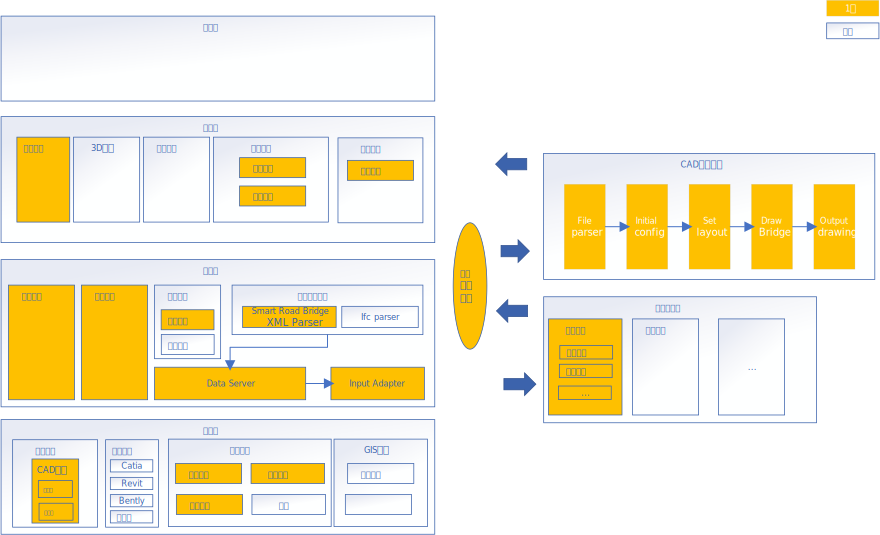

# 智能设计

[TOC]

# 一、整体框架设计

- 功能框图

# 二、信息数据结构模型设计

## 1. 数据结构模型设计

- ER实体关系图

## 2. 中间交互格式标准说明

- DTD\XSD

[详细说明](./docs/中间交换文件格式标准.md)

# 三、关键技术与主要工作内容

# 四、团队成员与组织结构

# 五、工作计划

## 1. 分期工作说明

## 2. 第1期工作计划